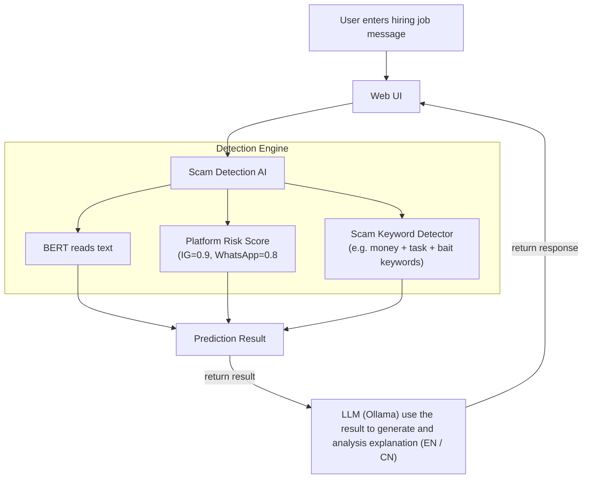
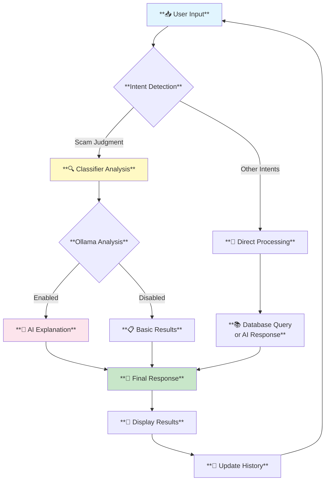
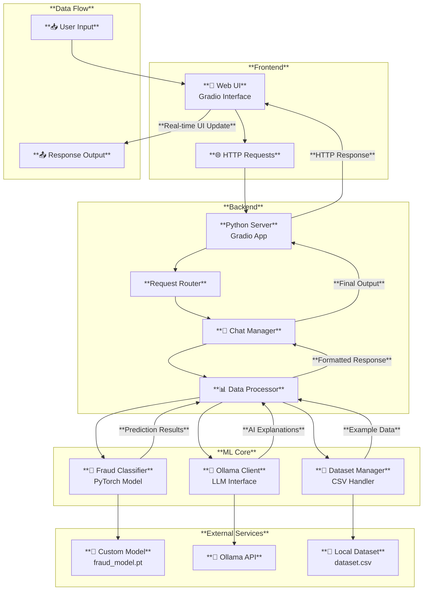

BERT-based Fraud Detection with LLM-powered Explanation

## Overview

## System Architecture

## Machine Learning Pipeline

## Key Features

## Technology Stack

## Project Structure

## How to Run

## Example

## Development

## License

# System Architecture Diagram

